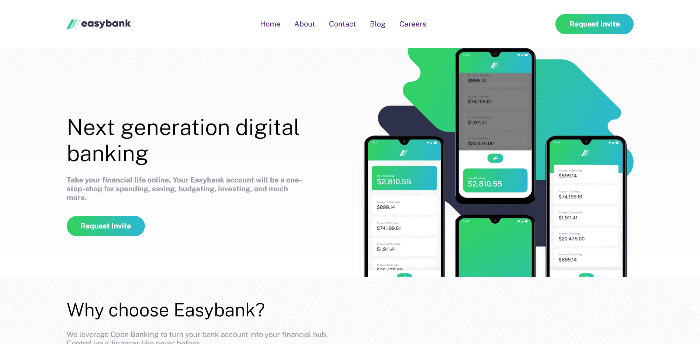

# Frontend Mentor - Easybank landing page solution

This is a solution to the [Easybank landing page challenge on Frontend Mentor](https://www.frontendmentor.io/challenges/easybank-landing-page-WaUhkoDN). Frontend Mentor challenges help you improve your coding skills by building realistic projects. 

## Table of contents

- [Overview](#overview)
  - [The challenge](#the-challenge)
  - [Screenshot](#screenshot)
  - [Links](#links)
- [My process](#my-process)
  - [Built with](#built-with)
  - [What I learned](#what-i-learned)
  - [Continued development](#continued-development)
  - [Useful resources](#useful-resources)
- [Author](#author)
- [Acknowledgments](#acknowledgments)

## Overview

### The challenge

Users should be able to:

- View the optimal layout for the site depending on their device's screen size
- See hover states for all interactive elements on the page

### Screenshot

### Links

- Solution URL: [*VIEW CODE*](https://github.com/Phurba-Sherpa/easybank-landing-page)
- Live Site URL: [*PREVIEW SITE*](https://phurba-sherpa.github.io//easybank-landing-page/)

## My process

### Built with

- Semantic HTML5 markup
- CSS custom properties
- Grid
- CSS Subgrid
- Mobile-first workflow
- BEM

### What I learned

Got more confident with mobile nav. Still need to work on subgrid comfortable and BEM methodology.

## Author

- Website - [*PHURBA SHERPA PORTFOLIO*](https://phurba.sherpa.name.np)
- Frontend Mentor - [*@Phurba-Sherpa*](https://www.frontendmentor.io/profile/Phurba-Sherpa)
- Medium - [*@phurba*](https://medium.com/@phurba)